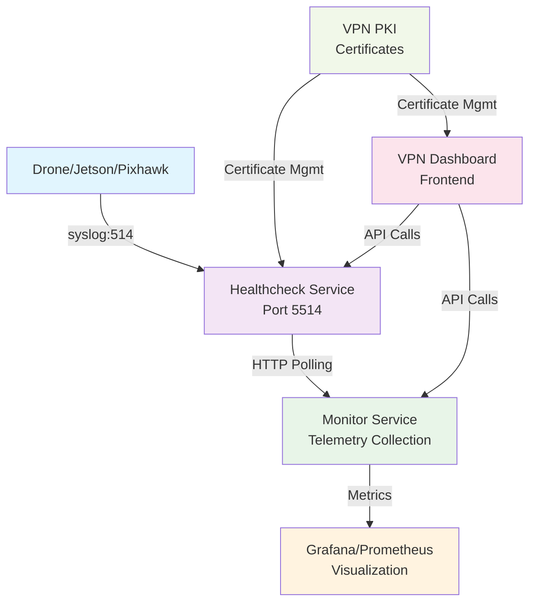

# Jedsy VPN Monitoring System - Architecture and Next Steps

## System Overview

The Jedsy VPN Monitoring System consists of several interconnected services that work together to provide comprehensive monitoring of VPN endpoints, with a particular focus on drone connectivity.

## Component Responsibilities

### VPN Dashboard

- **Purpose**: Web-based frontend for monitoring VPN endpoints
- **Technology**: Node.js, React, TypeScript
- **Key Features**:
  - Device listing and status overview
  - Device detail pages
  - Real-time monitoring of drone telemetry
  - Network status visualization

### Healthcheck Service

- **Purpose**: Backend service for monitoring VPN endpoint connectivity and processing drone telemetry
- **Technology**: Go, PostgreSQL  
- **Communication**: Receives syslog data from drones on port 5514
- **Key Features**:
  - Real-time syslog data processing from drones/Jetson/Pixhawk devices
  - Ping monitoring of VPN endpoints
  - Status API for endpoint health
  - Interface type handling (main/FTS)
  - Device-specific enhanced status API
  - Telemetry data forwarding to Monitor Service

### Monitor Service

- **Purpose**: Telemetry data collection, processing, and metrics aggregation
- **Technology**: Go, PostgreSQL
- **Communication**: HTTP polling from Healthcheck Service, metrics export to Grafana/Prometheus
- **Key Features**:
  - Telemetry data collection via HTTP API
  - Data processing and aggregation
  - Historical data storage
  - Metrics export for monitoring systems
  - Alerting and notification triggers

### VPN PKI

- **Purpose**: Certificate management for VPN endpoints
- **Technology**: Go, PostgreSQL
- **Key Features**:
  - Certificate generation and management
  - Endpoint registration
  - Certificate revocation
  - Security monitoring

## Recent Achievements

1. **Improved Interface Type Handling**:

   - Enhanced support for both string and numeric interface types
   - Fixed display issues for different interface types (main/FTS)
   - Improved consistency between frontend and backend

2. **Enhanced Status API**:

   - Added detailed endpoint information
   - Implemented device-specific filtering
   - Improved error handling and response formats

3. **Frontend Performance Optimization**:

   - Minimized unnecessary re-rendering
   - Optimized DOM updates for real-time monitoring
   - Improved visual feedback for status changes

4. **Code Organization and Maintenance**:
   - Reorganized test scripts
   - Improved documentation
   - Better error logging and debugging

## Next Steps

### Short-term (1-2 weeks)

1. **Staging Deployment**:

   - Deploy updated services to staging environment
   - Verify functionality in staging environment
   - Test with production-like data

2. **Performance Testing**:

   - Conduct load testing on Healthcheck Service
   - Optimize database queries
   - Improve caching strategies

3. **Documentation Updates**:
   - Update API documentation
   - Create user guides for new features
   - Document deployment procedures

### Medium-term (1-2 months)

1. **Enhanced Monitoring Features**:

   - Add more telemetry visualization options
   - Implement historical status tracking
   - Develop trend analysis capabilities

2. **Security Enhancements**:

   - Improve authentication and authorization
   - Implement more granular access controls
   - Security audit and hardening

3. **Additional Device Support**:
   - Expand support for different device types
   - Improve device type detection
   - Add custom monitoring profiles per device type

### Long-term (3+ months)

1. **Scalability Improvements**:

   - Redesign for higher endpoint counts
   - Implement service clustering
   - Optimize database for large datasets

2. **Advanced Analytics**:

   - Implement predictive analytics for endpoint health
   - Add anomaly detection
   - Create customizable dashboards

3. **Integration with Other Systems**:
   - Connect with notification systems
   - Integrate with fleet management
   - External API availability
